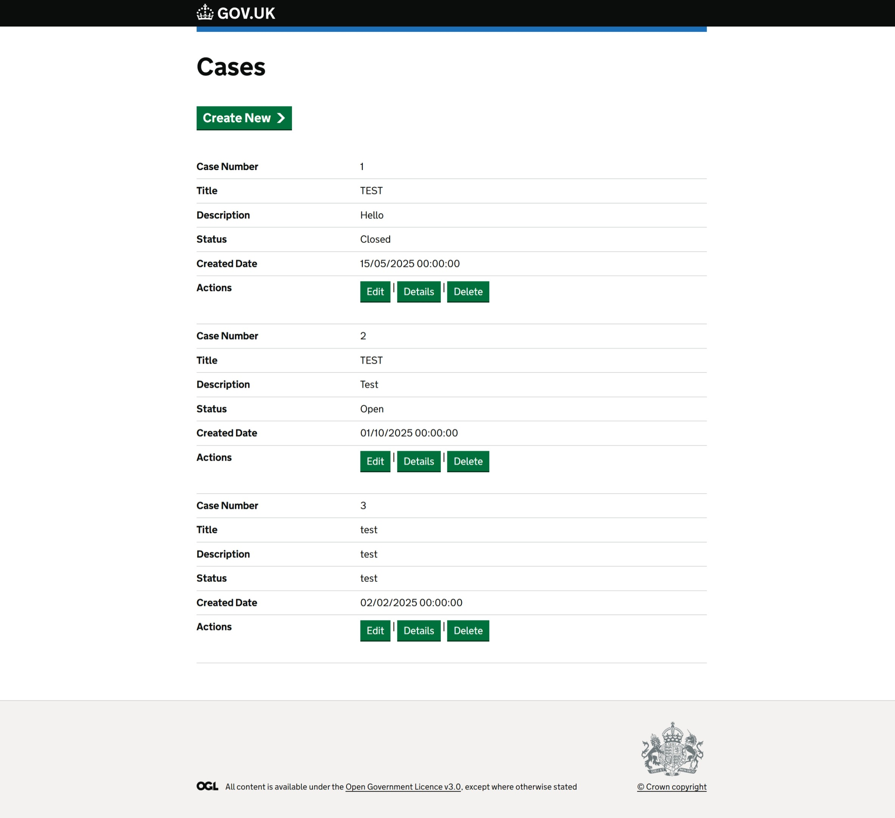
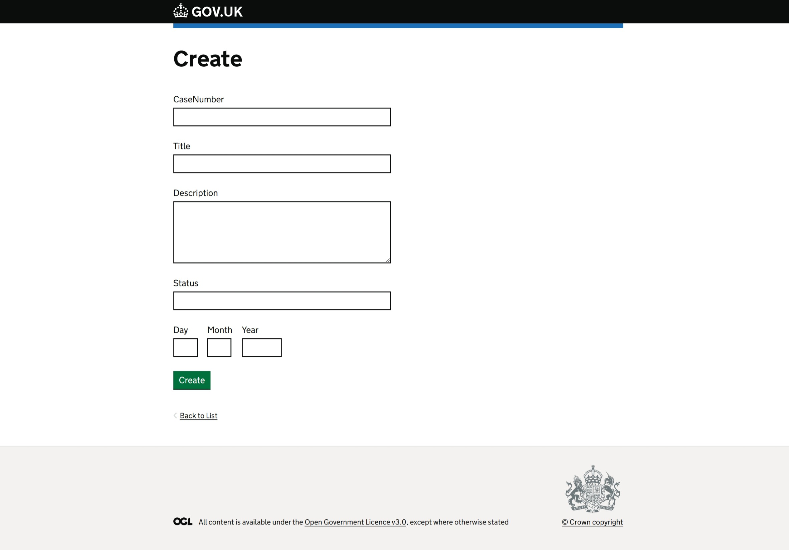
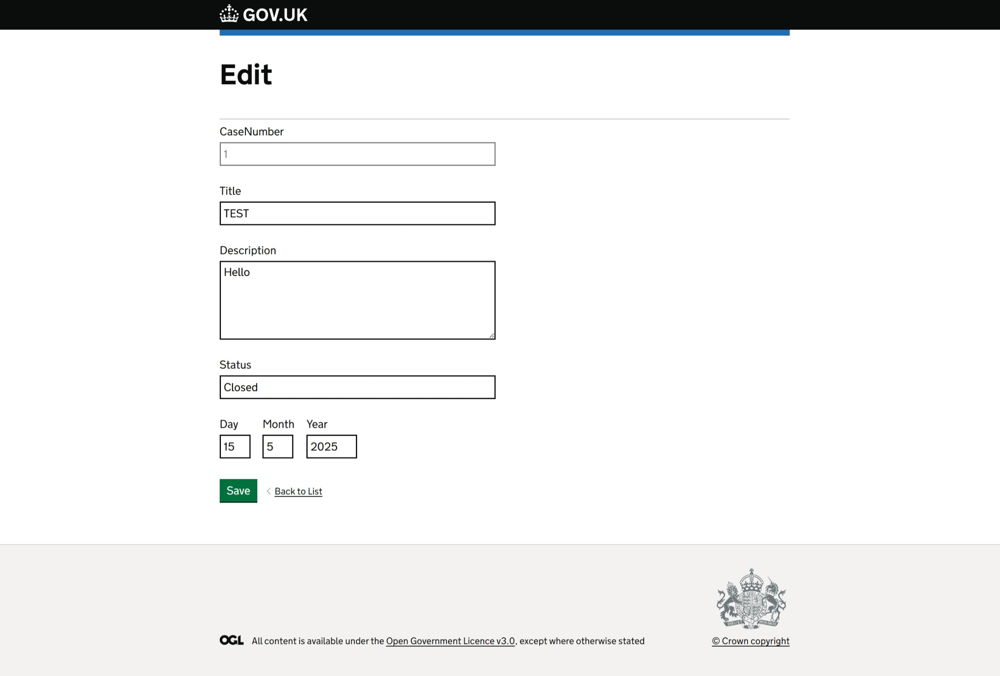
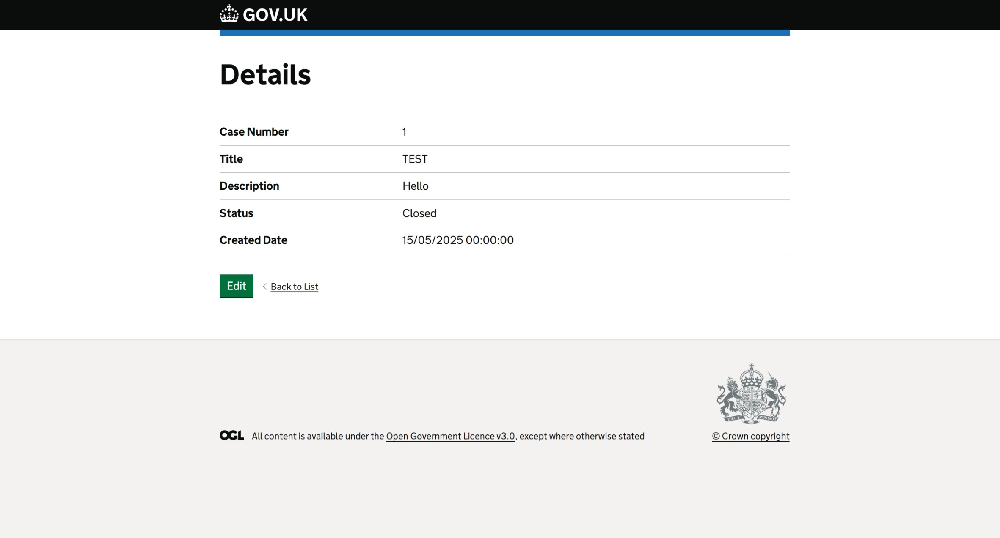
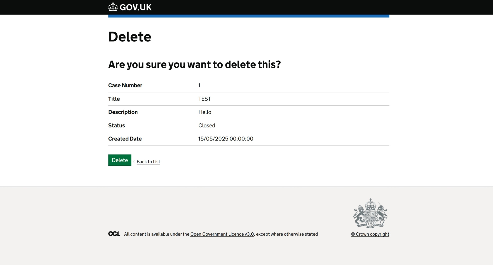

# HMCTS Developer Challege - Written in C# with ASP .NET Core, Gov UK design system integration, Entity Framework, Moq and XUnit.

This project is a Razor Pages application designed to manage cases for the HMCTS. It provides functionality to create, edit, view, and delete cases.

## Features
- **Case Management**: CRUD application.
- **Validation**: Model data validation.
- **Unit Testing**: Uses of Moq and XUnit.
- **In-Memory Database**: Simplified testing with an in-memory database.

## Tools and Technologies
This project is built using the following tools and packages:

### Frameworks and Libraries
- **.NET 9**
- **ASP.NET Core Razor Pages**
- **Entity Framework Core**
- **xUnit and Moq**

### NuGet Packages
- `Microsoft.EntityFrameworkCore`: Core library for Entity Framework.
- `Microsoft.EntityFrameworkCore.InMemory`: In-memory database provider for testing.
- `Microsoft.AspNetCore.Mvc.RazorPages`: Razor Pages framework.
- `Microsoft.AspNetCore.Mvc`: For handling HTTP requests and responses.
- `GovUk.Frontend.AspNetCore`: Access to the Gov UK design system for .NET.

## Project Structure
- **Pages**: Contains Razor Pages for the application.
- **Models**: Defines the data models used in the application.
- **Data**: Contains the `HmctsContext` class for database access.
- **Tests**: Unit tests for the application.

## Screenshots
Below are some screenshots of the application:

### Home Page

### Create Page

### Edit Page

### Details Page

### Delete Page

### Data Validation

## Getting Started
### Prerequisites
- Install [.NET 9 SDK](https://dotnet.microsoft.com/download/dotnet/9.0).
- Install Visual Studio with the C# Dev Kit extensions.

### Running the Application
1. Clone the repository
2. Open is VS Code
3. Build
